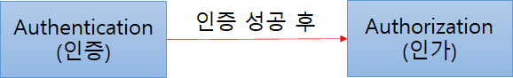

## Spring Security

#### Spring Security 5 for Reactive

 

> Spring Security는 Spring 기반의 애플리케이션의 보안(인증과 권한, 인가 등)을 담당하는 스프링 하위 프레임워크이다. Spring Security는 '인증'과 '권한'에 대한 부분을 Filter 흐름에 따라 처리하고 있다. Filter는 Dispatcher Servlet으로 가기 전에 적용되므로 가장 먼저 URL 요청을 받지만, Interceptor는 Dispatcher와 Controller사이에 위치한다는 점에서 적용 시기의 차이가 있다. Spring Security는 보안과 관련해서 체계적으로 많은 옵션을 제공해주기 때문에 개발자 입장에서는 일일이 보안관련 로직을 작성하지 않아도 된다는 장점이 있다.

#### 인증 (Authorization) & 인가(Authentication)

- 인증 (Authorization): 해당 사용자가 본인이 맞는지 확인
- 인가 (Authentication): 인증된 사용자가 요청한 자원에 접근이 가능한지 결정

즉, Spring Security에서는 **[인증 -> (인증 성공) -> 인가]** 의 절차를 거친다.

##### 

**Credential 기반의 인증 방식 사용**

- Principle: 아이디, 접근 주체, 보호받는 Resource에 접근하는 대상
- Credential: 비밀번호, 접근 주체의 비밀번호

### Spring Security의 주요 모듈

#### [SecurityContextHolder]

> SecurityContextHolder는 보안 주체의 세부 정보를 포함하여 응용프래그램의 현재 보안 컨텍스트에 대한 세부 정보가 저장된다. SecurityContextHolder는 기본적으로 <u>SecurityContextHolder.MODE_INHERITABLETHREADLOCAL</u> 방법과<u>SecurityContextHolder.MODE_THREADLOCAL</u> 방법을 제공한다.

#### **[ SecurityContext ]**

>  **Authentication**을 보관하는 역할을 하며, <u>SecurityContext를 통해 Authentication 객체를 꺼내올 수 있다</u>. 

#### **[ Authentication ]**

> Authentication는 현재 접근하는 주체의 정보와 권한을 담는 인터페이스이다. Authentication 객체는 Security Context에 저장되며, SecurityContextHolder를 통해 SecurityContext에 접근하고, SecurityContext를 통해 Authentication에 접근할 수 있다.

