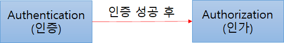

## Spring Security

#### Spring Security 5 for Reactive

 

> Spring Security는 Spring 기반의 애플리케이션의 보안(인증과 권한, 인가 등)을 담당하는 스프링 하위 프레임워크이다. Spring Security는 '인증'과 '권한'에 대한 부분을 Filter 흐름에 따라 처리하고 있다. Filter는 Dispatcher Servlet으로 가기 전에 적용되므로 가장 먼저 URL 요청을 받지만, Interceptor는 Dispatcher와 Controller사이에 위치한다는 점에서 적용 시기의 차이가 있다. Spring Security는 보안과 관련해서 체계적으로 많은 옵션을 제공해주기 때문에 개발자 입장에서는 일일이 보안관련 로직을 작성하지 않아도 된다는 장점이 있다.


#### 인증 (Authorization) & 인가(Authentication)

- 인증 (Authorization): 해당 사용자가 본인이 맞는지 확인
- 인가 (Authentication): 인증된 사용자가 요청한 자원에 접근이 가능한지 결정

즉, Spring Security에서는 **[인증 -> (인증 성공) -> 인가]** 의 절차를 거친다.

##### 

**Credential 기반의 인증 방식 사용**

- Principle: 아이디, 접근 주체, 보호받는 Resource에 접근하는 대상
- Credential: 비밀번호, 접근 주체의 비밀번호


### Spring Security의 주요 모듈


#### [SecurityContextHolder]

> SecurityContextHolder는 보안 주체의 세부 정보를 포함하여 응용프래그램의 현재 보안 컨텍스트에 대한 세부 정보가 저장된다. SecurityContextHolder는 기본적으로 <u>SecurityContextHolder.MODE_INHERITABLETHREADLOCAL</u> 방법과<u>SecurityContextHolder.MODE_THREADLOCAL</u> 방법을 제공한다.

#### **[ SecurityContext ]**

>  **Authentication**을 보관하는 역할을 하며, <u>SecurityContext를 통해 Authentication 객체를 꺼내올 수 있다</u>. 

#### **[ Authentication ]**

> Authentication는 현재 접근하는 주체의 정보와 권한을 담는 인터페이스이다. Authentication 객체는 Security Context에 저장되며, SecurityContextHolder를 통해 SecurityContext에 접근하고, SecurityContext를 통해 Authentication에 접근할 수 있다.

```java
public interface Authentication extends Principal, Serializable { 
  // 현재 사용자의 권한 목록을 가져옴 
  Collection<? extends GrantedAuthority> getAuthorities(); 
  
  // credentials(주로 비밀번호)을 가져옴 
  Object getCredentials(); 
  Object getDetails(); 
  
  // Principal 객체를 가져옴. 
  Object getPrincipal(); 
  
  // 인증 여부를 가져옴 
  boolean isAuthenticated(); 
  // 인증 여부를 설정함 
  void setAuthenticated(boolean isAuthenticated) throws IllegalArgumentException; 
}
```

#### **[ UsernamePasswordAuthenticationToken ]**

UsernamePasswordAuthenticationToken은 Authentication을 implements한 AbstractAuthenticationToken의 하위 클래스로, User의 ID가 Principal 역할을 하고, Password가 Credential의 역할을 한다. UsernamePasswordAuthenticationToken의 첫 번째 생성자는 인증 전의 객체를 생성하고, 두번째 생성자는 인증이 완려된 객체를 생성한다.

```java
public class UsernamePasswordAuthenticationToken extends AbstractAuthenticationToken {
    // 주로 사용자의 ID에 해당함
    private final Object principal;
    // 주로 사용자의 PW에 해당함
    private Object credentials;
    
    // 인증 완료 전의 객체 생성
    public UsernamePasswordAuthenticationToken(Object principal, Object credentials) {
		super(null);
		this.principal = principal;
		this.credentials = credentials;
		setAuthenticated(false);
	}
    
    // 인증 완료 후의 객체 생성
    public UsernamePasswordAuthenticationToken(Object principal, Object credentials,
			Collection<? extends GrantedAuthority> authorities) {
		super(authorities);
		this.principal = principal;
		this.credentials = credentials;
		super.setAuthenticated(true); // must use super, as we override
	}
}


public abstract class AbstractAuthenticationToken implements Authentication, CredentialsContainer {
}
```


#### **[ AuthenticationProvider ]** - 실제 인증에 대한 부분 처리

AuthenticationProvider에서는 실제 인증에 대한 부분을 처리하는데, 인증 전의 Authentication객체를 받아서 인증이 완료된 객체를 반환하는 역할을 한다. 아래와 같은 AuthenticationProvider 인터페이스를 구현해서 Custom한 AuthenticationProvider을 작성해서 AuthenticationManager에 등록하면 된다.

```java
public interface AuthenticationProvider {

	// 인증 전의 Authenticaion 객체를 받아서 인증된 Authentication 객체를 반환
    Authentication authenticate(Authentication var1) throws AuthenticationException;

    boolean supports(Class<?> var1);
    
}
```


#### **[ Authentication Manager ]**

인증에 대한 부분은 SpringSecurity의 AuthenticatonManager를 통해서 처리하게 되는데, 실질적으로는 AuthenticationManager에 등록된 AuthenticationProvider에 의해 처리된다. 인증이 성공하면 2번째 생성자를 이용해 인증이 성공한(isAuthenticated=true) 객체를 생성하여 Security Context에 저장한다. 그리고 인증 상태를 유지하기 위해 세션에 보관하며, 인증이 실패한 경우에는 AuthenticationException를 발생시킨다.

```java
public interface AuthenticationManager {
	Authentication authenticate(Authentication authentication) 
		throws AuthenticationException;
}
```

AuthenticationManager를 implements한 ProviderManager는 실제 인증 과정에 대한 로직을 가지고 있는 AuthenticaionProvider를 List로 가지고 있으며, ProividerManager는 for문을 통해 모든 provider를 조회하면서 authenticate 처리를 한다.


```java
public class ProviderManager implements AuthenticationManager, MessageSourceAware,
InitializingBean {
    public List<AuthenticationProvider> getProviders() {
		return providers;
	}
    public Authentication authenticate(Authentication authentication)
			throws AuthenticationException {
		Class<? extends Authentication> toTest = authentication.getClass();
		AuthenticationException lastException = null;
		Authentication result = null;
		boolean debug = logger.isDebugEnabled();
        //for문으로 모든 provider를 순회하여 처리하고 result가 나올 때까지 반복한다.
		for (AuthenticationProvider provider : getProviders()) {
            ....
			try {
				result = provider.authenticate(authentication);

				if (result != null) {
					copyDetails(authentication, result);
					break;
				}
			}
			catch (AccountStatusException e) {
				prepareException(e, authentication);
				// SEC-546: Avoid polling additional providers if auth failure is due to
				// invalid account status
				throw e;
			}
            ....
		}
		throw lastException;
	}
}
```


위에서 설명한 ProviderManager에 우리가 직접 구현한 CustomAuthenticationProvider를 등록하는 방법은 WebSecurityConfigurerAdapter를 상속해 만든 SecurityConfig에서 할 수 있다. WebSecurityConfigurerAdapter의 상위 클래스에서는 AuthenticationManager를 가지고 있기 때문에 우리가 직접 만든 CustomAuthenticationProvider를 등록할 수 있다.

```java
@Configuration
@EnableWebSecurity
public class SecurityConfig extends WebSecurityConfigurerAdapter {
  
    @Bean
    public AuthenticationManager getAuthenticationManager() throws Exception {
        return super.authenticationManagerBean();
    }
      
    @Bean
    public CustomAuthenticationProvider customAuthenticationProvider() throws Exception {
        return new CustomAuthenticationProvider();
    }
    
    @Override
    protected void configure(AuthenticationManagerBuilder auth) throws Exception {
        auth.authenticationProvider(customAuthenticationProvider());
    }
}
```


### **[ UserDetails ]**

인증에 성공하여 생성된 UserDetails 객체는 Authentication객체를 구현한 UsernamePasswordAuthenticationToken을 생성하기 위해 사용된다. UserDetails 인터페이스를 살펴보면 아래와 같이 정보를 반환하는 메소드를 가지고 있다. UserDetails 인터페이스의 경우 직접 개발한 UserVO 모델에 UserDetails를 implements하여 이를 처리하거나 UserDetailsVO에 UserDetails를 implements하여 처리할 수 있다.

```java
public interface UserDetails extends Serializable {

    Collection<? extends GrantedAuthority> getAuthorities();

    String getPassword();

    String getUsername();

    boolean isAccountNonExpired();

    boolean isAccountNonLocked();

    boolean isCredentialsNonExpired();

    boolean isEnabled();
    
}
```


#### **[ UserDetailsService ]**

UserDetailsService 인터페이스는 UserDetails 객체를 반환하는 단 하나의 메소드를 가지고 있는데, 일반적으로 이를 구현한 클래스의 내부에 UserRepository를 주입받아 DB와 연결하여 처리한다. UserDetails 인터페이스는 아래와 같다.

```java
public interface UserDetailsService {

    UserDetails loadUserByUsername(String var1) throws UsernameNotFoundException;

}
```


#### **[ Password Encoding ]**

AuthenticationManagerBuilder.userDetailsService().passwordEncoder() 를 통해 패스워드 암호화에 사용될 PasswordEncoder 구현체를 지정할 수 있다.

```java
@Override
protected void configure(AuthenticationManagerBuilder auth) throws Exception {
	// TODO Auto-generated method stub
	auth.userDetailsService(userDetailsService).passwordEncoder(passwordEncoder());
}

@Bean
public PasswordEncoder passwordEncoder(){
	return new BCryptPasswordEncoder();
}
```


#### **[ GrantedAuthority ]**

GrantAuthority는 현재 사용자(principal)가 가지고 있는 권한을 의미한다. ROLE_ADMIN나 ROLE_USER와 같이 ROLE_*의 형태로 사용하며, 보통 "roles" 이라고 한다. GrantedAuthority 객체는 UserDetailsService에 의해 불러올 수 있고, 특정 자원에 대한 권한이 있는지를 검사하여 접근 허용 여부를 결정한다.


출처: https://mangkyu.tistory.com/76 [MangKyu's Diary]
